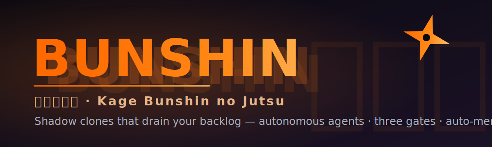

<p align="center">
  
</p>

<h1 align="center">影分身 &nbsp;Bunshin</h1>

<p align="center">
  <em>Kage Bunshin no Jutsu — the Shadow Clone Technique, for your backlog.</em>
</p>

<p align="center">
  
  
  
  
  
  
</p>

> 🍥 **In the anime, a ninja forms a hand-seal and *poof* — an army of shadow clones peels off to do
> the work while the original rests.** That's exactly this tool. Bunshin drops clone-agents
> (implement · verify · review) that go off and finish your goals on their own — code → three gates →
> auto-merge — with **no human in the review loop**. You stack goals on a **Trello board or Jira
> project**; the clones drain it.

Autonomous **goal loop for Claude Code**, driven by your **Trello board or Jira project**. It is
**process-only**: there is no
orchestrator daemon. The package ships the markdown pipeline (a driver procedure + three agent briefs)
and a thin CLI that drops a single per-repo config file into any repo and launches the Claude Code
`/loop` that follows it.

### Why "Bunshin"?

> **分身 (bunshin)** = "a divided body; a clone." **影分身 (kage bunshin)** = "shadow clone."
> One source, many copies doing the work in parallel — the loop spawns fresh agent "clones" per goal,
> and the multi-agent future is literally *Tajū* Kage Bunshin: many at once. 🥷

## Requirements

- [Claude Code](https://docs.claude.com/claude-code) installed, with `claude` on your `PATH`.
- A **task-tracker MCP server** for your `provider.kind`: the **Trello MCP** (`mcp__trello__*`) or a
  **Jira MCP** (e.g. the Atlassian MCP). The driver moves goals between columns through it.
- The **Playwright MCP server** configured (Gate 2 smoke-tests the change in a browser).
- Node.js ≥ 18 — only to run the CLI itself, which has **zero npm dependencies** (pure Node
  built-ins, so `npx` pulls in nothing). Note this is separate from the runtime prerequisites above:
  the **pipeline needs Claude Code + a Trello *or* Jira MCP + the Playwright MCP** to do its work.

> The `setup` command (below) can **install the MCP servers for you** — it runs `claude mcp add` with
> your approval and your credentials. Configuring them by hand is also a one-time Claude Code step.

## Usage

The npm name `bunshin` is taken, so it's distributed straight from the repo — run it with `npx`
(no install) or install the `bunshin` command globally.

### `setup` — guided, interactive (recommended)

```bash
# from the root of the repo you want to drain:
npx github:cidfenix/bunshin setup
```

Opens a **Claude Code session** that walks you through it conversationally — picks your tracker
(Jira/Trello), connection details, merge strategy, and toolchain commands, fills in
`bunshin.config.json`, and then **checks and installs the required MCP servers** (Trello/Jira +
Playwright) with your approval. When it's done, commit the config and run:

```bash
git add bunshin.config.json && git commit -m "add bunshin"
npx github:cidfenix/bunshin run
```

Prefer a persistent command? `npm i -g github:cidfenix/bunshin`, then `bunshin setup` / `bunshin run`.

### `init` — just write the config (no prompts)

For scripted/CI setups. Bunshin is **config-only**: the only file it adds to your repo is
**`bunshin.config.json`** at the root. The driver + the three agent briefs live inside this package and
are served from there at run time, so there's nothing generic to copy into (or duplicate across) your
repos.

```
your-repo/
  bunshin.config.json        # THE ONLY FILE BUNSHIN ADDS (per-repo) — commit it
  .bunshin/artifacts/        # committed Gate-2 screenshots (created on first run)
```

Useful flags:

```bash
npx github:cidfenix/bunshin init --name MyApp --base-branch main --board-id <trelloBoardId>
npx github:cidfenix/bunshin init --force     # overwrite an existing bunshin.config.json
```

`bunshin.config.json` is the only repo-specific thing — board ids, the worktree base dir, your
install/gate/dev-server commands, and the benign-console-error allowlist. The driver and briefs read
every value from it. **Update the pipeline** for all your repos at once with
`npm i -g github:cidfenix/bunshin` — no per-repo changes.

### `run` — launch the loop

```bash
npx github:cidfenix/bunshin run                 # self-paced /loop, drains the queue (re-checks every 20m)
npx github:cidfenix/bunshin run --once          # process exactly one goal, then stop
npx github:cidfenix/bunshin run --interval 30m  # different re-check cadence
npx github:cidfenix/bunshin run --unattended    # skip Claude Code permission prompts (hands-off — careful)
```

`run` refuses to start if the working tree is dirty (it fast-forward-merges finished goals into the
current tree) or if there's no `bunshin.config.json` yet.

## How a goal flows

1. The driver takes the first **Pending** card, moves it to **In Progress**, and cuts an isolated
   worktree off the base branch (`N` = the goal's id — Trello card `idShort` or Jira issue key).
2. **Gate 1 (deterministic):** an implement agent codes the goal TDD-style; the driver runs your
   `install` then `gateChecks` (typecheck/build/test).
3. **Gate 2 (behavioral):** a verify agent boots your dev server, exercises the feature with
   Playwright, asserts it renders with no new console errors, and commits a screenshot.
4. **Gate 3 (review):** a fresh adversarial agent reviews the diff and returns BLOCK or APPROVE.
5. **Integrate** (configurable via `merge.mode`):
   - **`auto`** (default): rebase, re-run `gateChecks`, fast-forward merge into the base branch, card
     → **Done**. No remote or GitHub needed.
   - **`pr`**: push the branch, open a GitHub **Pull Request**, card → **In Review**. A review reaper
     then auto-merges it once your gate is met — **≥ N approvals and/or a label** (optionally green
     checks) — or, with the gate off, simply marks the card **Done** after a human merges. Needs a
     remote + the `gh` CLI or a GitHub MCP.

   Any gate failure → **Blocked** with the reason (branch kept).

The card's list is the authoritative status, so a run is **crash-resumable**. Implementation is
**serial** and parks on the **first** gate failure — no auto-repair; you re-queue by dragging the card
back to **Pending**. (In `pr` mode, multiple PRs can sit in **In Review** at once.)

## License

MIT
