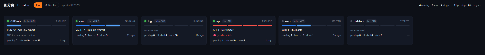
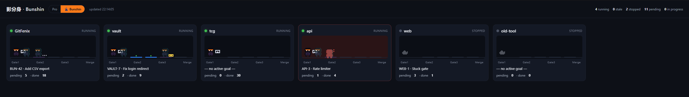

<p align="center">
  
</p>

<h1 align="center">影分身 &nbsp;Bunshin</h1>

<p align="center">
  <em>Kage Bunshin no Jutsu — the Shadow Clone Technique, for your backlog.</em>
</p>

<p align="center">
  
  
  
  
  
  
</p>

> 🍥 **In the anime, a ninja forms a hand-seal and *poof* — an army of shadow clones peels off to do
> the work while the original rests.** That's exactly this tool. Bunshin drops clone-agents
> (implement · verify · review) that go off and finish your goals on their own — code → a
> **configurable gate pipeline** → auto-merge — with **no human in the review loop**. You stack goals
> on a **Trello board or Jira project**; the clones drain it.

Autonomous **goal loop**, driven by your **Trello board or Jira project**. It is
**process-only**: there is no
orchestrator daemon. The package ships the markdown pipeline (a driver procedure + the built-in **gate
presets** in `template/gates/`) and a thin CLI that drops a single per-repo config file into any repo and
launches an **agent CLI** to follow it — **Claude Code** (its self-paced `/loop`) by default, or
**Codex** (`codex exec`), selected by `agent.kind`. One board can even drive **many repositories** at
once — see [Orchestrator mode](#orchestrator-mode--one-board-many-repositories).

### Why "Bunshin"?

> **分身 (bunshin)** = "a divided body; a clone." **影分身 (kage bunshin)** = "shadow clone."
> One source, many copies doing the work in parallel — the loop spawns fresh agent "clones" per goal,
> and the multi-agent future is literally *Tajū* Kage Bunshin: many at once. 🥷

## Requirements

- An **agent CLI** for your `agent.kind`, installed with its binary on your `PATH`:
  [**Claude Code**](https://docs.claude.com/claude-code) (`claude`, the default) **or**
  [**Codex**](https://github.com/openai/codex) (`codex`). See
  [Agent runtime](#agent-runtime--claude-code-or-codex) below; absent ⇒ Claude Code.
- A **task-tracker MCP server** for your `provider.kind`: the **Trello MCP** (`mcp__trello__*`) or a
  **Jira MCP** (e.g. the Atlassian MCP). The driver moves goals between columns through it.
- The **Playwright MCP server** — only if your pipeline keeps the **`verify`** gate (it smoke-tests the
  change in a browser). Non-web repos that drop `verify` from `gates.steps` don't need it. See
  [Gate pipeline](#gate-pipeline--configurable-per-repo).
- Node.js ≥ 18 — only to run the CLI itself, which has **zero npm dependencies** (pure Node
  built-ins, so `npx` pulls in nothing). Note this is separate from the runtime prerequisites above:
  the **pipeline needs your agent CLI (Claude Code *or* Codex) + a Trello *or* Jira MCP**, plus the
  **Playwright MCP** when the `verify` gate is in play.

> The `setup` command (below) can **install the MCP servers for you** — it runs `claude mcp add` with
> your approval and your credentials. Configuring them by hand is a one-time step too — see
> [Setting up the MCP servers](#setting-up-the-mcp-servers) below.

## Agent runtime — Claude Code or Codex

The agent CLI that actually runs the pipeline is **pluggable** via the `agent.kind` field in
`bunshin.config.json`:

| `agent.kind` | CLI (binary on `PATH`) | How Bunshin launches it |
| --- | --- | --- |
| `claude` *(default)* | [Claude Code](https://docs.claude.com/claude-code) (`claude`) | Self-paced `/loop` slash command on the `--interval` cadence |
| `codex` | [Codex](https://github.com/openai/codex) (`codex`) | `codex exec "<prompt>"` — **once per invocation** |

Omitting the `agent` block (or `agent.kind`) keeps the original behavior — **Claude Code** — so
existing setups are unchanged. The selected CLI must be **installed and on your `PATH`**; `run` and
`setup` refuse to start otherwise (telling you which binary is missing).

```jsonc
{
  "agent": {
    "kind": "codex"   // "claude" (default) or "codex"
  }
}
```

**The behavioral difference matters for cadence.** Claude Code drives the queue with its own
self-rescheduling `/loop`: `bunshin run` re-checks the board every `--interval` (default `20m`) until
Pending is empty, all inside one session. **Codex has no `/loop`**, so Bunshin launches it just once
per `run` via `codex exec` — it drains what it can in that single pass and then exits. To get a
recurring cadence with Codex, pair `bunshin run` with an **external scheduler** (cron, a systemd
timer, Task Scheduler, etc.) rather than relying on a self-rescheduling loop; `--interval` has no
effect under Codex.

The same selection applies to every command: `init` writes the `agent` block, `setup` launches the
chosen CLI for the interactive guided setup, and `run` launches it for the autonomous loop. The
`--unattended` flag maps to each CLI's "skip all approvals" switch — `--dangerously-skip-permissions`
for Claude Code, `--dangerously-bypass-approvals-and-sandbox` for Codex.

## Gate pipeline — configurable per repo

Each goal runs through an **ordered list of gates** defined by `gates.steps` in `bunshin.config.json`.
Omit the block (or leave `steps` empty) and you get the built-in default —
**`implement` → `verify` → `review`** — so existing setups are unchanged. Every entry is either the
**name of a built-in gate** or a **custom step object**:

| Built-in gate | What it does |
| --- | --- |
| `implement` | Codes the goal TDD-style, then runs `commands.install` + `commands.gateChecks`. |
| `verify` | Boots `commands.devServer` and Playwright-smokes the feature, committing a screenshot. **Web-only.** |
| `review` | A fresh adversarial agent reviews the diff → APPROVE / BLOCK. |
| `readme` | A fresh adversarial **docs** agent: BLOCKs when a user-facing change didn't update `README.md`. **Opt-in** — name it in `gates.steps` (not in the default pipeline). |

Custom steps splice in your own checks: `{"command": "<shell>", "name": "…"}` (a **non-zero exit**
Blocks the goal) or `{"skill": "<name>", "name": "…"}` (run an agent skill). Steps run in array order,
**fail-fast** — the first failure parks the goal in **Blocked**.

The payoff: **non-web repos can drop the `verify` gate**, reorder the rest, or mix in their own checks.
Bunshin's own config (a zero-dep CLI with no dev server) drops `verify`:

```jsonc
{
  "gates": {
    // runs top-to-bottom, fail-fast; "verify" omitted — nothing to smoke-test in a browser
    "steps": [
      "implement",
      { "command": "npm run lint", "name": "lint" },   // custom shell gate
      "review"
    ]
  }
}
```

The built-in gate presets are **served from the package** as one file per gate under
**`template/gates/<name>.md`** (`implement` / `verify` / `review`, the orchestrator-only `triage`, and
the opt-in docs gate `readme`); the driver dispatches each by name. The pure resolver is `resolveGates()`
in `src/util.js`.

## Setting up the MCP servers

`bunshin setup` can install these for you with your approval; to wire them by hand, these are one-time
`claude mcp add` commands. You only need the **tracker MCP that matches your `provider.kind`** — Jira
**or** Trello, not both — plus **Playwright**. Add `-s project` to any command to record it in the
repo's `.mcp.json` (shared with your team via git); omit it to keep the server in your personal Claude
config. Confirm they all connect with `claude mcp list` (or `/mcp` inside Claude Code) before `run`.

**Playwright** — the `verify` gate's browser smoke test (skip it if your pipeline drops `verify`):

```bash
claude mcp add playwright -- npx @playwright/mcp@latest
```

**Jira** — the official **Atlassian Remote MCP** (OAuth, nothing to paste):

```bash
claude mcp add --transport http atlassian https://mcp.atlassian.com/v1/mcp
```

Then run `/mcp` in Claude Code and authenticate `atlassian` in the browser. (An older
`--transport sse … /v1/sse` endpoint exists but is being retired — use the `/v1/mcp` HTTP endpoint
above.)

**Trello** — [`@delorenj/mcp-server-trello`](https://github.com/delorenj/mcp-server-trello); get a
Trello API key + token from <https://trello.com/power-ups/admin>:

```bash
claude mcp add trello \
  -e TRELLO_API_KEY=<your-key> \
  -e TRELLO_TOKEN=<your-token> \
  -- npx -y @delorenj/mcp-server-trello
```

## Usage

The npm name `bunshin` is taken, so it's distributed straight from the repo — run it with `npx`
(no install) or install the `bunshin` command globally.

### `setup` — guided, interactive (recommended)

```bash
# from the root of the repo you want to drain:
npx github:cidfenix/bunshin setup
```

Opens an interactive **agent session** (Claude Code by default, or Codex per `agent.kind`) that walks
you through it conversationally — picks your tracker (Jira/Trello), connection details, merge strategy,
and toolchain commands, fills in `bunshin.config.json`, and then **checks and installs the required MCP
servers** (Trello/Jira + Playwright) with your approval. When it's done, commit the config and run:

```bash
git add bunshin.config.json && git commit -m "add bunshin"
npx github:cidfenix/bunshin run
```

Prefer a persistent command? `npm i -g github:cidfenix/bunshin`, then `bunshin setup` / `bunshin run`.

### `init` — just write the config (no prompts)

For scripted/CI setups. Bunshin is **config-only**: the only file it adds to your repo is
**`bunshin.config.json`** at the root. The driver + the built-in gate presets (`template/gates/`) live
inside this package and are served from there at run time, so there's nothing generic to copy into (or
duplicate across) your repos.

```
your-repo/
  bunshin.config.json        # THE ONLY FILE BUNSHIN ADDS (per-repo) — commit it
  .bunshin/artifacts/        # committed Gate-2 screenshots (created on first run)
```

Useful flags:

```bash
npx github:cidfenix/bunshin init --name MyApp --base-branch main --board-id <trelloBoardId>
npx github:cidfenix/bunshin init --force     # overwrite an existing bunshin.config.json
```

`bunshin.config.json` is the only repo-specific thing — board ids, the worktree base dir, your
install/gate/dev-server commands, the `gates.steps` pipeline, and the benign-console-error allowlist.
The driver and the gate presets read every value from it. **Update the pipeline** for all your repos at
once with `npm i -g github:cidfenix/bunshin` — no per-repo changes.

To drive **many repositories from one board**, write the orchestrator variant instead:
`npx github:cidfenix/bunshin init --orchestrator` (see
[Orchestrator mode](#orchestrator-mode--one-board-many-repositories)).

### `run` — launch the loop

```bash
npx github:cidfenix/bunshin run                 # self-paced /loop, drains the queue (re-checks every 20m)
npx github:cidfenix/bunshin run --once          # process exactly one goal, then stop
npx github:cidfenix/bunshin run --interval 30m  # different re-check cadence (Claude Code /loop only)
npx github:cidfenix/bunshin run --unattended    # skip the agent CLI's permission prompts (hands-off — careful)
npx github:cidfenix/bunshin run --orchestrator  # drive MANY repos from one board (bunshin.orchestrator.json)
```

`run` refuses to start if the working tree is dirty (it fast-forward-merges finished goals into the
current tree), if there's no `bunshin.config.json` yet, or if the configured agent CLI isn't on your
`PATH`. (In `--orchestrator` mode the clean-tree guard is skipped — the merge target is each listed
repo, not the orchestrator folder.)

The cadence above is the **Claude Code `/loop`** default. With `agent.kind: "codex"`, `run` launches
`codex exec` **once** and exits — `--interval` is ignored, so wrap `run` in an external scheduler for a
recurring cadence (see [Agent runtime](#agent-runtime--claude-code-or-codex)).

### `watch` — one dashboard for every running repo

Running Bunshin in several repos at once? `watch` serves a single localhost dashboard showing them
all: which loops are alive, the goal each is on, and which gate of the pipeline it's in.

```bash
npx github:cidfenix/bunshin watch            # serve at http://127.0.0.1:4317
npx github:cidfenix/bunshin watch --open     # …and open it in your browser
npx github:cidfenix/bunshin watch --port 5000
```

The dashboard has **two view modes**, switched by a header toggle (your choice is remembered).

**Pro** — the clean status-tile grid:



**🥷 Bunshin** — a pixel-art "nerd" view that renders the pipeline literally as *Kage Bunshin no
Jutsu*: each repo's loop is a ninja that idles / checks the board, then casts a shadow clone to work a
goal, and that clone poofs a sub-clone at the active gate station (Gate 1 → Gate 2 → Gate 3 → Merge).
Same data, just for fun.



Every `bunshin run` registers itself in a shared per-user home, **`~/.bunshin/`** — that directory is
what relates your repos. `run` records each repo's identity and process there; the driver writes a
small heartbeat as it moves through the gates. `watch` is a **pure file reader** (zero deps, no tracker
credentials): it never calls Jira/Trello — the driver, which already queries the tracker each
iteration, stamps the current card and queue counts into the heartbeat for it. A repo shows as
**running**, **stale** (PID alive but the heartbeat went quiet — a likely stuck gate), or **stopped**.

## How a goal flows

The gates below are the **default pipeline** (`implement → verify → review`); a repo can reorder them,
drop `verify`, or splice in custom steps via `gates.steps`
([Gate pipeline](#gate-pipeline--configurable-per-repo)).

1. The driver takes the first **Pending** card, moves it to **In Progress**, and cuts an isolated
   worktree off the base branch (`N` = the goal's id — Trello card `idShort` or Jira issue key).
2. **`implement` (deterministic):** an implement agent codes the goal TDD-style; the driver runs your
   `install` then `gateChecks` (typecheck/build/test).
3. **`verify` (behavioral, web-only):** a verify agent boots your dev server, exercises the feature with
   Playwright, asserts it renders with no new console errors, and commits a screenshot. (Dropped by
   config-only/CLI repos.)
4. **`review`:** a fresh adversarial agent reviews the diff and returns BLOCK or APPROVE.
5. **Integrate** (configurable via `merge.mode`):
   - **`auto`** (default): rebase, re-run `gateChecks`, fast-forward merge into the base branch, card
     → **Done**. No remote or GitHub needed.
   - **`pr`**: push the branch, open a GitHub **Pull Request**, card → **In Review**. A review reaper
     then auto-merges it once your gate is met — **≥ N approvals and/or a label** (optionally green
     checks) — or, with the gate off, simply marks the card **Done** after a human merges. Needs a
     remote + the `gh` CLI or a GitHub MCP.

   Any gate failure → **Blocked** with the reason (branch kept).

The card's list is the authoritative status, so a run is **crash-resumable**. Implementation is
**serial** and parks on the **first** gate failure — no auto-repair; you re-queue by dragging the card
back to **Pending**. (In `pr` mode, multiple PRs can sit in **In Review** at once.)

## Orchestrator mode — one board, many repositories

Normally one board drives one repo. **Orchestrator mode** lets a single Jira project / Trello board
drive **many repositories** from one place. It uses a distinctly-named config —
**`bunshin.orchestrator.json`** — that coexists with a single-repo `bunshin.config.json` (a repo can
evolve *itself* **and** orchestrate *others*). The **`--orchestrator`** flag selects it on `init`,
`setup`, and `run`:

```bash
npx github:cidfenix/bunshin init --orchestrator     # write bunshin.orchestrator.json into this folder
npx github:cidfenix/bunshin run  --orchestrator      # drive every listed repo from one board
```

The orchestrator config lists the target repositories under `repositories[]` — each with a unique `id`,
a git `remote` and/or local `path`, an optional `baseBranch`, and a `description` used for routing — and
leads its `gates.steps` with the **`triage`** gate:

```jsonc
{
  "repositories": [
    { "id": "web", "name": "Acme Web", "remote": "git@github.com:acme/web.git",
      "path": "../acme-web", "description": "Customer-facing Next.js app: checkout, account UI." },
    { "id": "api", "name": "Acme API", "remote": "git@github.com:acme/api.git",
      "path": "../acme-api", "description": "Backend REST/GraphQL service: endpoints, auth, jobs." }
  ],
  "gates": { "steps": ["triage", "implement", "review"] }
}
```

**`triage`** is a built-in gate (kept **first** in `gates.steps`): for each goal it reads the goal text
against every repo's `description` + its `CLAUDE.md`/`README`, picks the ONE repository the goal belongs
to, and implements it there through the remaining gates. If triage **can't confidently place** a goal,
it's moved to **Blocked** with a comment naming the candidates — never guessed. You can supply your own
triage instead as a `{"skill": …}` / `{"command": …}` step. The orchestrator home folder needn't be a
repo being changed (the merge target is each listed repo), so the clean-tree guard doesn't apply to it.
The list is validated up front by `resolveRepositories()` in `src/util.js`, so a malformed config fails
fast.

## License

MIT
